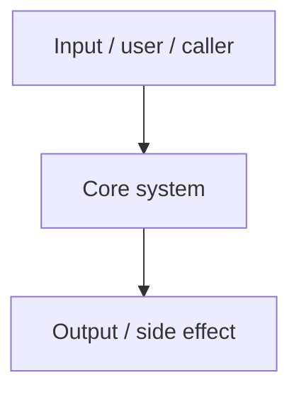

# Architecture

This document provides a high-level overview of the **<!-- Project name -->** architecture.

## 1. High-Level System Overview

<!-- Add a Mermaid diagram only when it materially improves understanding. Remove this placeholder if prose is enough. -->

## 2. Core Components

<!-- Replace example component sections with real core components. Remove unused examples. -->

### 2.1. <!-- Component Name -->

<!-- Description of the component's responsibility. -->

- **Technology**: <!-- e.g. runtime, framework, service -->
- **Responsibility**: <!-- What this component owns -->
- **Key interactions**: <!-- Reads from / writes to / invokes -->

## 3. Data Stores

<!-- Replace example data stores with the real stores that matter. If none exist, state that briefly and remove the example subsection. -->

### 3.1. <!-- Store Name -->

- **Technology**: <!-- e.g. PostgreSQL, DynamoDB -->
- **Purpose**: <!-- What this store is used for -->
- **Schema Management**: <!-- e.g. Prisma, Liquibase -->

## 4. Technologies

<!-- Keep only the core technologies that materially help readers understand the stack. -->

- **Runtime**: <!-- e.g. Node.js, Python, Go, Java, Swift -->
- **Frameworks**: <!-- e.g. React, FastAPI, Django, Spring -->
- **Infrastructure**: <!-- e.g. Terraform, Kubernetes, serverless, hosted platform -->

## 5. Deployment & Infrastructure

<!-- Replace with the real deployment and delivery surfaces. If none exist, state that briefly and remove the example list. -->

- **Cloud Provider**: <!-- e.g. AWS, GCP -->
- **CI/CD**: <!-- e.g. GitHub Actions -->
- **Environments**: <!-- e.g. local, staging, prod -->
- **Operational notes**: <!-- sharp edges, approvals, manual steps -->

## 6. Security Considerations

<!-- Keep only security considerations that are actually relevant to this repository. If none exist, state that briefly and remove the example list. -->

- **Authentication**: <!-- e.g. OAuth2, Cognito -->
- **Authorization**: <!-- e.g. RBAC, IAM -->
- **Encryption**: <!-- e.g. KMS, TLS -->

## 7. Development & Testing Environment

<!-- Link to CONTRIBUTING.md or workflow docs only when they exist. -->

## 8. References

<!-- Add only references that are actually useful to future readers. If none exist, state that briefly and remove the example list. -->

- <!-- Link to external doc -->
- <!-- Link to design doc -->
